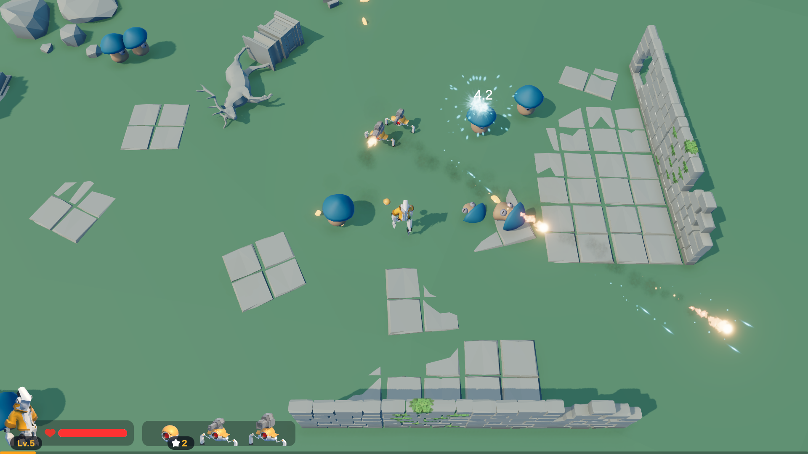
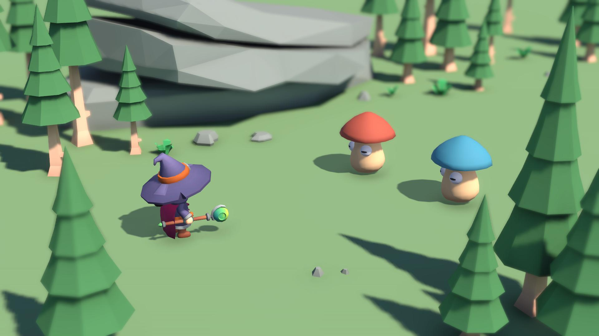
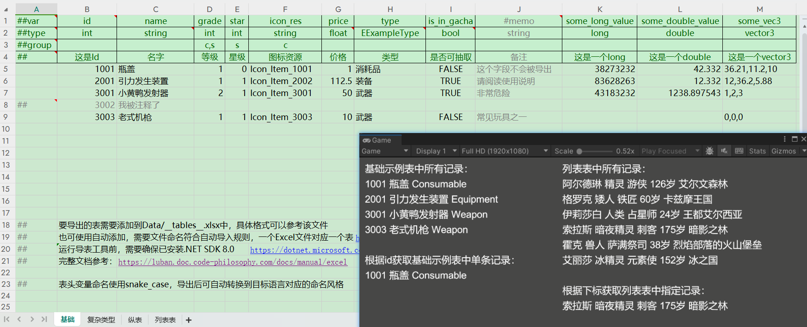
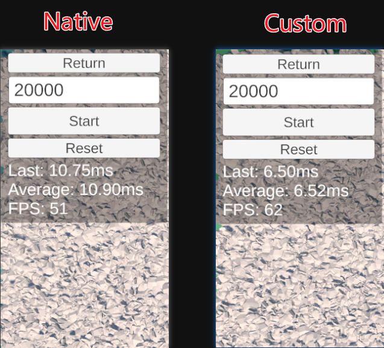
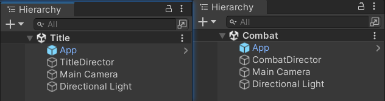
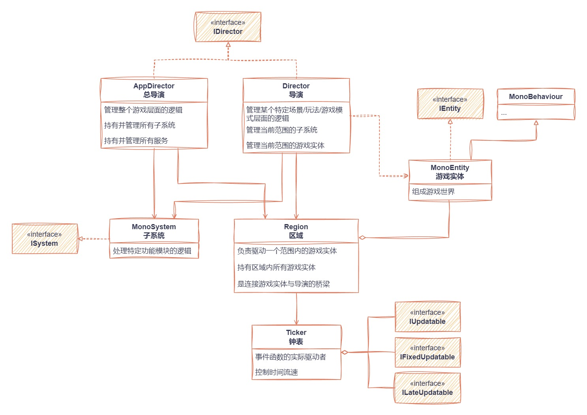
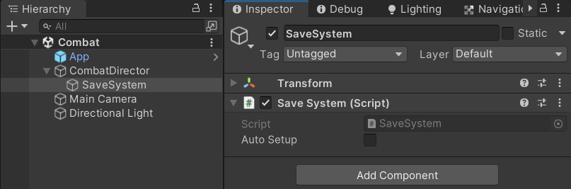
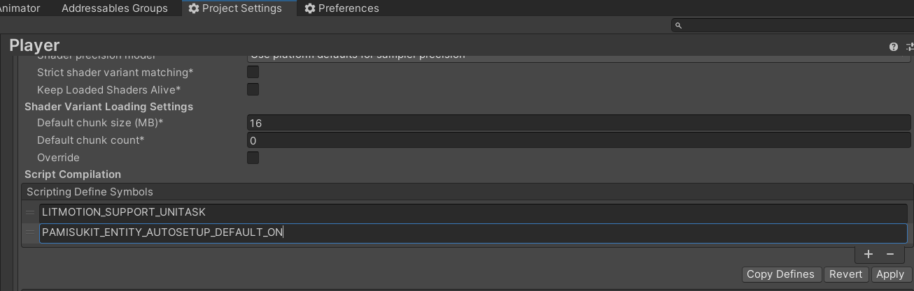

个人的Unity游戏开发套件与一些示例项目。（开发中，当前Unity版本2022.3.x LTS）

开发套件基本成型，将会随着个人参与的项目与这里的示例项目的开发而不断更新。

示例项目龟速开发中，主要包含一些具有代表性的、功能较为常见与通用的项目，其中的功能模块可复用到具有类似需求的项目中。

# 目录
- [示例项目](#示例项目)
  - [Droid Gear (WIP)](#droid-gear-wip)
  - [Tiny Farm (WIP)](#tiny-farm-wip)
  - [Wizzywoods (WIP)](#wizzywoods-wip)
  - [Luban Example - Luban示例](#luban-example---luban示例)
  - [Benchmark - 基准测试](#benchmark---基准测试)
    - [自管理的Update](#自管理的update)
- [开发套件](#开发套件)
  - [安装](#安装)
  - [通用工具](#通用工具)
  - [Gameplay框架](#gameplay框架)
    - [开始上手](#开始上手)
    - [框架结构](#框架结构)
    - [导演](#导演)
    - [子系统](#子系统)
    - [游戏实体](#游戏实体)
    - [事件总线集成](#事件总线集成)
    - [服务定位器](#服务定位器)
    - [区域暂停与倍速](#区域暂停与倍速)
    - [自管理的事件函数](#自管理的事件函数)

# 示例项目
## Droid Gear (WIP)
[🔗](./samples/DroidGear/) 类幸存者。



亮点：
- Character框架
- 能力系统（属性、技能、Buff)
- 模块化升级

## Tiny Farm (WIP)
[🔗](./samples/TinyFarm/) 农场模拟。

## Wizzywoods (WIP)
[🔗](./samples/Wizzywoods/)回合制策略Rogue-like。


## Luban Example - Luban示例
[🔗](./samples/LubanExample/) [配置工具Luban](https://luban.doc.code-philosophy.com/)使用示例。


## Benchmark - 基准测试
[🔗](./samples/Benchmark/)一些针对套件的基准测试。

### 自管理的Update
[🔗](./samples/Benchmark/Assets/Benchmark/CustomUpdate/) 在[Gameplay框架](#gameplay框架)中实现了一套自管理的事件函数（OnCreate、IUpdatable、IFixedUpdatable等），以取代Unity原生的事件函数（Awake、Start、Update、FixedUpdate等）。与原生事件函数相比，自管理的事件函数有序执行，且执行效率略高于原生。

在这个测试中，场景中有20000个猴头在不断地移动和旋转，比较使用自管理实现（IUpdatable）的帧率，和使用原生事件函数（Update）实现的帧率，无论是编辑器中运行，还是打包后运行，自管理都比原生的帧数要高些。



Last: 上一次所有物体Update执行总耗时

Average: 所有物体Update执行总耗时的平均值

# 开发套件
## 安装
[UniTask](https://github.com/Cysharp/UniTask)是PamisuKit的唯一第三方依赖项，需要先安装它，可以通过[git URL](https://github.com/Cysharp/UniTask/?tab=readme-ov-file#install-via-git-url)方式安装，或通过[Unity Package](https://github.com/Cysharp/UniTask/releases/)方式安装。

然后将[src/PamisuKit](./src/PamisuKit/)文件夹复制到项目的Packages文件夹下即可。

> TODO 之后增加git URL与Unity Package安装方式

## 通用工具
[🔗](./src/PamisuKit/Runtime/Common/)包含一些基础的工具实现。

- 简易Addressable资源管理
- 有限状态机
- 对象池
- 事件总线（零GC）
- 工具类（Unity、随机、数学等等）

## Gameplay框架
[🔗](./src/PamisuKit/Runtime/Framework/)一套极简且轻量的Gameplay框架。[框架结构UML](#框架结构)

- 系统内角色划分清晰明确成体系
- 抛弃传统单例模式，所有单例（子系统、服务等）更易于管理
- 自管理的事件函数，事件函数有序执行且效率比原生高
- 集成事件总线，无需手动处理事件的取消订阅
- “区域”让部分元素暂停、倍速功能的实现更简单

### 开始上手

首先创建一个类继承`AppDirector`，负责处理整个游戏层面的逻辑，整个游戏只会有一个`AppDirector`。

**App.cs**

```C#
using PamisuKit.Framework;

public class App : AppDirector<App>
{
}
```

将其挂载在一个游戏物体上，如果游戏有多场景切换，则需要勾选Dont Destroy On Load选项。


然后创建场景/玩法/游戏模式相关的`Director`，负责处理该场景/玩法/游戏模式层面的逻辑，例如游戏有标题、战役两种游戏模式，则可以创建TitleDirector与CombatDirector：

**TitleDirector.cs**

```C#
using PamisuKit.Framework;

public class TitleDirector : Director
{
}
```

**CombatDirector.cs**

```C#
using PamisuKit.Framework;

public class CombatDirector : Director
{
}
```

分别在Title场景与Combat场景挂载它们：



接下来编写其他脚本即可，只需要将`MonoBehaviour`替换为`MonoEntity`，不要使用原生的事件函数如`Update`，而是用`IUpdatable`这样的接口替代，其他照常：

```C#
using PamisuKit.Framework;
using UnityEngine;

public class Player : MonoEntity, IUpdatable
{
    [SerializeField]
    private float _moveSpeed;

    // Player被初始化时执行
    protected override void OnCreate()
    {
        base.OnCreate();
        // 初始化玩家角色...
    }

    // 在OnCreate执行完毕后的下一帧执行
    public void OnUpdate(float deltaTime)
    {
        // Update逻辑...
    }

    // 使用OnSelfDestroy替代OnDestroy
    protected override void OnSelfDestroy()
    {
        base.OnSelfDestroy();
        // 销毁逻辑...
    }
}
```

`MonoEntity`需要初始化后才能工作，以下是几种初始化方式：

**示例1 创建物体、挂载脚本并初始化**
```C#
public class CombatDirector : Director
{
    private void InitPlayer()
    {
        // 实例化玩家，将会创建一个名为Player的物体，挂载Player脚本，并执行其初始化
        var player = Region.NewMonoEntity<Player>();
    }
}
```

**示例2 实例化预制体并初始化**
```C#
public class MonsterSpawner : MonoEntity
{
    [SerializeField]
    private GameObject _monsterPrefab;

    public void SpawnMonster()
    {
        // 实例化Monster预制体
        var monster = Instantiate(_monsterPrefab, Trans).GetComponent<Monster>();
        // 初始化
        monster.Setup(Region);
    }
}
```

**示例3 勾选Auto Setup自动初始化**


### 框架结构


### 导演
导演`Director`负责处理某个场景/玩法/游戏模式层面的逻辑，这类逻辑都可以放到其中。`Director`同时只能存在一个，场景中所有的`MonoEntity`都会注册到`Director`中，`MonoEntity`中可以使用`GetDirector`函数获取到当前`Director`：

```C#
public class Player : MonoEntity
{
    public void Foo()
    {
        var director = GetDirector<CombatDirector>();
        // ...
    }
}
```

> `GetDirector`的开销非常小，不需要像`GetComponent`那样将结果保存为成员变量

`Director`有两种模式，`Normal`和`Global`，可以在Inspector中设置。`Global`模式适合整个游戏只有一个Director存在的情况。

场景加载后，场景中的第一个Director将被初始化。当一个模式为`Global`的Director被初始化后，它将成为App的子物体，不随场景切换而销毁（前提是App勾选了Dont Destroy On Load），之后再加载其他场景，其中的Director将不会被初始化。

### 子系统
子系统负责处理特定功能模块的逻辑，这个功能模块可以是全局的，也可以是特定游戏模式下的，例如存档系统、成就系统、物品与背包系统、商店系统等等。子系统必须通过`Director`或`AppDirector`来创建。

编写一个子系统类，继承`MonoSystem`：

**SaveSystem.cs**

```C#
using PamisuKit.Framework;

public class SaveSystem : MonoSystem
{
    // 被创建时调用
    protected override void OnCreate()
    {
        base.OnCreate();
        // 初始化逻辑...
    }
}
```

在`Director`中使用`CreateMonoSystem`函数来创建它：

```C#
using PamisuKit.Framework;

public class CombatDirector : Director
{
    protected override void OnCreate()
    {
        base.OnCreate();
        CreateMonoSystem<SaveSystem>();
    }
}
```

这样在运行时将会在CombatDirector物体下创建一个挂载了`SaveSystem`脚本的物体。

在上面的基础上，也可以在编辑器中给Director物体下创建子物体并挂载`SaveSystem`脚本，方便在Inspector中设置参数，当`CreateMonoSystem<SaveSystem>()`执行时，会自动获取SaveSystem子物体并将其初始化。



在`MonoEntity`中，使用`GetSystem`函数获取指定类型的子系统实例：

```C#
public class Player : MonoEntity
{
    public void Foo()
    {
        var saveSystem = GetSystem<SaveSystem>();
        // ...
    }
}
```

> `GetSystem`的开销同样也非常小

> `MonoSystem`继承自`MonoEntity`

如果一个子系统需要在整个游戏层面全局存在，可以将它放到`AppDirector`中创建。

### 游戏实体
`MonoEntity`是组成游戏世界的实体，Director和子系统之外的职责都可以交给`MonoEntity`实现。

`MonoEntity`需要被包含在一个`Region`即“区域”内，每个`MonoEntity`初始化时需要指定其`Region`，`Director`中会包含一个默认的`Region`，初始化时传入的`Region`参数将会赋值给成员变量，在初始化其他`MonoEntity`时可以使用这个变量。

```C#
public class MonsterSpawner : MonoEntity
{
    [SerializeField]
    private GameObject _monsterPrefab;

    public void SpawnMonster()
    {
        // 实例化Monster预制体
        var monster = Instantiate(_monsterPrefab, Trans).GetComponent<Monster>();
        // 初始化
        monster.Setup(Region);
    }
}
```

当在Inspector中勾选`Auto Setup`后，`MonoEntity`将会自动初始化：


也可以在代码中覆写（优先使用此值）：

```C#
public class Player : MonoEntity
{
    protected override bool AutoSetupOverride => true;
}
```

自动初始化将会寻找场景中第一个`Director`，调用它的相应函数，使用其中的默认`Region`来初始化自身。需要注意自动初始化将会让事件函数的执行回归无序（见[自管理的事件函数](#自管理的事件函数)），考虑到目前大部分使用场景都是手动初始化，该选项默认不勾选（为false），可以在Project Settings -> Player -> Other Settings -> Scripting Define Symbols中添加`PAMISUKIT_ENTITY_AUTOSETUP_DEFAULT_ON`将其改为默认true。



如果`Director`的初始化为耗时操作，需要等待`Director`初始化完毕后才开始`MonoEntity`的自动初始化，可以在`Director`中自定义这个过程，详见[Luban Example](#luban-example---luban示例)中的[GameDirector.cs](samples\LubanExample\LubanExampleUnity\Assets\Scripts\Game\GameDirector.cs)。

### 事件总线集成

通用工具中包含了一个[事件总线实现](./src/PamisuKit/Runtime/Common/EventBus.cs)，可以单独使用，下面是独立于Gameplay框架的用法：

```C#
// 定义一个事件
public struct GreetingEvent
{
    public string Message;
}

public class A : MonoBehaviour
{
    public void Foo()
    {
        // 发送事件
        EventBus.Emit(new GreetingEvent { Message = "Hello!"});
    }
}

public class B : MonoBehaviour
{
    private void Start()
    {
        // 订阅事件
        EventBus.OnRaw<GreetingEvent>(OnGreeting);
    }

    private void OnDestroy()
    {
        // 取消订阅
        EventBus.Off<GreetingEvent>(OnGreeting);
    }

    private void OnGreeting(GreetingEvent e)
    {
        Debug.Log($"Message: {e.Message}");
    }
}
```

事件总线在解耦合时非常有用，但需要记得取消订阅，否则容易出问题。Gameplay框架在`MonoEntity`中做了事件总线的集成，事件订阅会被自动管理，下面是基于Gameplay框架的用法：

```C#
// 定义一个事件
public struct GreetingEvent
{
    public string Message;
}

public class A : MonoEntity
{
    public void Foo()
    {
        // 发送事件
        Emit(new GreetingEvent { Message = "Hello!"});
    }
}

public class B : MonoEntity
{
    protected override void OnCreate()
    {
        base.OnCreate();
        // 订阅事件，无需手动取消订阅
        On<GreetingEvent>(OnGreeting);
    }

    private void OnGreeting(GreetingEvent e)
    {
        Debug.Log($"Message: {e.Message}");
    }
}
```

当B销毁时，将会自动取消所有事件订阅，这个封装仅会在订阅事件时产生一个订阅对象的内存占用，大小可以忽略不计。

### 服务定位器
上面通过了解`GetDirector`和`GetSystem`的使用可以发现，框架使用服务定位器模式替代了传统单例模式，与传统单例模式相比更加灵活和方便管理。

如果游戏中存在无法划分到Director和子系统职责的类，但又需要有单例功能，可以将其注册成服务：

```C#
using PamisuKit.Framework;

public class SomeService : MonoEntity
{
    // 创建时注册
    protected override void OnCreate()
    {
        base.OnCreate();
        GetDirector<Director>().AppDirector.RegisterService(this);
    }

    // 销毁时移除
    protected override void OnSelfDestroy()
    {
        base.OnSelfDestroy();
        GetDirector<Director>().AppDirector.RemoveService(this);
    }
}
```

在`MonoEntity`中，使用AppDirector的`GetService`来获取指定服务：

```C#
public class Player : MonoEntity
{
    public void Bar()
    {
        var service = GetDirector<Director>().AppDirector.GetService<SomeService>();
        // ...
    }
}
```

### 区域暂停与倍速
区域`Region`是游戏实体`MonoEntity`的实际管理者，每个`MonoEntity`初始化后都会被包含在一个区域内。区域使用一个钟表`Ticker`来驱动所有`MonoEntity`的事件函数，通过修改`Ticker`的`TimeScale`来影响区域内物体的时间流速。

例如使用`IUpdatable`时，传入的`deltaTime`会受到`TimeScale`的影响:

```C#
public class Ball : MonoEntity, IUpdatable
{
    // ...    
    public void OnUpdate(float deltaTime)
    {
        Trans.Translate(_moveSpeed * deltaTime * _moveDirection, Space.World);
    }
}
```

通过以下代码修改`Ticker`的`TimeScale`，球的运动将会变慢：

```C#
public void Foo()
{
    Region.Ticker.TimeScale = 0.5f;
}
```

对于`IFixedUpdatable`，`deltaTime`固定为`Time.fixedDeltaTime`，不会受到`TimeScale`的影响，但可以直接使用`TimeScale`修改刚体速度：

```C#
public class PhysicsBall : MonoEntity, IFixedUpdatable
{
    // ...
    public void OnFixedUpdate(float deltaTime)
    {
        _rigidbody.velocity = _moveSpeed * Region.Ticker.TimeScale * _moveDirection;
    }
}
```

一个常见的需求是，游戏内容在暂停和倍速时，UI内容不受影响，可以通过将游戏内容和UI内容放在不同区域来实现，详见示例项目[Droid Gear](#droid-gear)中的[GameDirector.cs](./samples/DroidGear/Assets/Scripts/Game/GameDirector.cs)。

### 自管理的事件函数
Unity原生的事件函数（Awake、Start、Update、FixedUpdate等）有一个痛点，它们默认是无序执行的，如果需要调整执行顺序，需要在Script Execution Order里手动设置。

无序执行容易带来一些麻烦，产生一些意想不到的Bug，例如场景中有A、B两个MonoBehaviour，二者都需要在Start函数中做初始化，而B需要依赖A，由于AB二者的Start函数执行顺序不确定，B的初始化可能会因此失败，不得不将A的初始化提前至Awake函数。项目中类似的情况变多之后，各脚本的初始化将会变得难以协调。

手动管理是一个更好的选择，并且也符合很多应用场景，例如一个战斗场景中，游戏的全局管理类先初始化，随后调用战斗管理类的初始化，在其中生成玩家与敌人，最后调用玩家与敌人的初始化。但这仍有一点缺陷，Update、FixedUpdate、LateUpdate等函数依然是乱序执行的。

在本Gameplay框架中，着重解决了这个问题，以上面的战斗场景为例，可以编写以下代码：

```C#
// 游戏的全局管理类/全局实例
public class App : AppDirector<App>
{
    // App的OnCreate最先执行
    protected override void OnCreate()
    {
        // 初始化Director依赖到的全局系统
        // ...
        // OnCreate中会初始化当前Director
        base.OnCreate();
    }
}

// 战斗场景中战斗逻辑的管理类
public class CombatDirector : Director
{
    // App初始化完毕后，CombatDirector的OnCreate才会执行
    protected override void OnCreate()
    {
        base.OnCreate();
        // 初始化战斗相关系统...
        // ...
        // 实例化玩家
        var player = Region.NewMonoEntity<Player>();
    }
}

// 玩家角色
public class Player : MonoEntity, IUpdatable
{
    // 玩家被生成时执行
    protected override void OnCreate()
    {
        base.OnCreate();
        // 初始化玩家角色...
    }

    // 在OnCreate执行完毕后的下一帧执行
    public void OnUpdate(float deltaTime)
    {
        // Update逻辑...
    }
}
```
