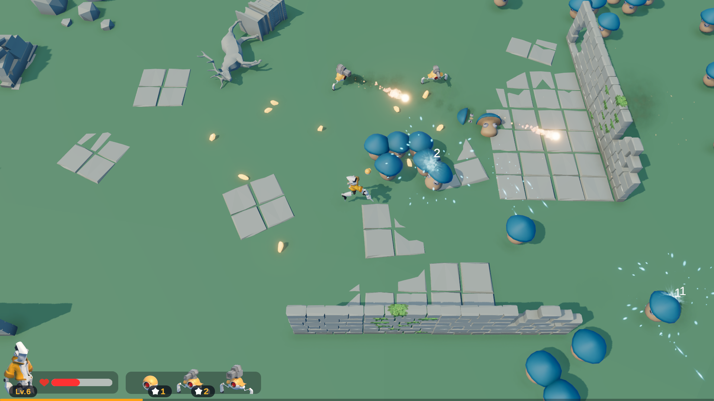

个人的Unity游戏开发套件与一些示例项目。（开发中，当前Unity版本2022.3.x LTS）

开发套件基本成型，将会随着个人参与的项目与这里的示例项目的开发而不断更新。

示例项目龟速开发中，主要包含一些具有代表性的、功能较为常见与通用的项目，其中的功能模块可复用到具有类似需求的项目中。

# 目录
- [示例项目](#示例项目)
  - [Droid Gear](#droid-gear)
  - [Tiny Farm (WIP)](#tiny-farm-wip)
  - [Wizzywoods (WIP)](#wizzywoods-wip)
  - [Luban Example - Luban示例](#luban-example---luban示例)
  - [Benchmark - 基准测试](#benchmark---基准测试)
    - [自管理的Update](#自管理的update)
- [开发套件](#开发套件)
  - [通用工具](#通用工具)
  - [Gameplay框架](#gameplay框架)
    - [开始上手](#开始上手)
    - [Director](#director)
    - [子系统](#子系统)
    - [事件总线集成](#事件总线集成)
    - [自动Setup](#自动setup)
    - [服务定位器](#服务定位器)
    - [自管理的事件函数](#自管理的事件函数)
    - [框架结构](#框架结构)

# 示例项目
## [Droid Gear](./samples/DroidGear/)
类幸存者。



亮点：
- Character框架
- 能力系统（属性、技能、Buff)
- 模块化升级

## [Tiny Farm](./samples/TinyFarm/) (WIP)
农场模拟。


## [Wizzywoods](./samples/Wizzywoods/) (WIP)
回合制策略Rogue-like。


## [Luban Example - Luban示例](./samples/LubanExample/)

[配置工具Luban](https://luban.doc.code-philosophy.com/)使用示例。

## [Benchmark - 基准测试](./samples/Benchmark/)
一些针对套件的基准测试。

### [自管理的Update](./samples/Benchmark/Assets/Benchmark/CustomUpdate/)
[Gameplay框架](#gameplay框架)实现了一套自管理的事件函数（OnCreate、IUpdatable、IFixedUpdatable等），以取代Unity原生的事件函数（Awake、Start、Update、FixedUpdate等）。与原生事件函数相比，自管理的事件函数有序执行，且执行效率略高于原生。

在这个测试中，场景中有20000个猴头在不断地移动和旋转，比较使用自管理实现（IUpdatable）的帧率，和使用原生事件函数（Update）实现的帧率，无论是编辑器中运行，还是打包后运行，自管理都比原生的帧数要高些。


Last: 上一次所有物体Update执行总耗时

Average: 所有物体Update执行平均耗时

# 开发套件
## [通用工具](./src/PamisuKit/Runtime/Common/)
包含一些基础的工具实现。

- 简易Addressable资源管理
- 有限状态机
- 对象池
- 事件总线（零GC）
- 工具类（Unity、随机、数学等等）

## [Gameplay框架](./src/PamisuKit/Runtime/Framework/)
一套极简且轻量的Gameplay框架。[框架结构UML](#框架结构)

- 系统内角色划分清晰明确成体系
- 抛弃传统单例模式，所有单例（子系统、服务等）更易于管理
- 自管理的事件函数，所有事件函数有序执行且效率比原生高
- 集成事件总线，无需手动处理事件的取消订阅
- “区域”让部分元素暂停、倍速功能的实现更简单

### 开始上手

首先创建一个类继承`AppDirector`，负责处理整个游戏层面的逻辑。

**App.cs**

```C#
using PamisuKit.Framework;

public class App : AppDirector<App>
{
}
```

将其挂载在一个游戏物体上，如果游戏有多场景切换，则需要勾选Dont Destroy On Load选项。


然后创建场景/玩法/游戏模式相关的`Director`，负责处理该场景/玩法/游戏模式层面的逻辑，例如游戏有标题、战役两种游戏模式，则可以创建TitleDirector与CombatDirector：

**TitleDirector.cs**

```C#
using PamisuKit.Framework;

public class TitleDirector : Director
{
}
```

**CombatDirector.cs**

```C#
using PamisuKit.Framework;

public class CombatDirector : Director
{
}
```

分别在Title场景与Combat场景挂载它们：


接下来编写其他脚本即可，只需要将`MonoBehaviour`替换为`MonoEntity`，不要使用原生的事件函数如`Update`，而是用`IUpdatable`这样的接口替代，其他照常：

```C#
using PamisuKit.Framework;
using UnityEngine;

public class Player : MonoEntity, IUpdatable
{
    [SerializeField]
    private float _moveSpeed;

    // 玩家被生成时执行
    protected override void OnCreate()
    {
        base.OnCreate();
        // 初始化玩家角色...
    }

    // 在OnCreate执行完毕后的下一帧执行
    public void OnUpdate(float deltaTime)
    {
        // Update逻辑...
    }

    // 使用OnSelfDestroy替代OnDestroy
    protected override void OnSelfDestroy()
    {
        base.OnSelfDestroy();
        // 销毁逻辑...
    }
}
```

### Director
`Director`负责处理某个场景/玩法/游戏模式层面的逻辑，这类逻辑都可以放到其中。`Director`同时只能存在一个，场景中所有的`MonoEntity`都会注册到`Director`中，`MonoEntity`中可以使用`GetDirector`函数获取到当前`Director`：

```C#
public class Player : MonoEntity
{
    public void Foo()
    {
        var director = GetDirector<CombatDirector>();
        // ...
    }
}
```

> `GetDirector`的开销非常小，不需要像`GetComponent`那样将结果保存为成员变量

### 子系统
子系统负责处理全局的、或某个场景/玩法/游戏模式下特定功能模块的逻辑，例如存档系统、成就系统、物品与背包系统、商店系统等等。子系统必须通过`Director`或`AppDirector`来创建。

编写一个子系统类，继承`MonoSystem`：

**SaveSystem.cs**

```C#
using PamisuKit.Framework;

public class SaveSystem : MonoSystem
{
    // 被创建时调用
    protected override void OnCreate()
    {
        base.OnCreate();
        // 初始化逻辑...
    }
}
```

在`Director`中使用`CreateMonoSystem`函数来创建它：

```C#
using PamisuKit.Framework;

public class CombatDirector : Director
{
    protected override void OnCreate()
    {
        base.OnCreate();
        CreateMonoSystem<SaveSystem>();
    }
}
```

这样在运行时将会在CombatDirector物体下创建一个挂载了`SaveSystem`脚本的物体。

在上面的基础上，也可以在编辑器中给Director物体下创建子物体并挂载`SaveSystem`脚本，方便在Inspector中设置参数，当`CreateMonoSystem<SaveSystem>()`执行时，会自动获取SaveSystem子物体并将其初始化。


在`MonoEntity`中，使用`GetSystem`函数获取指定类型的子系统实例：

```C#
public class Player : MonoEntity
{
    public void Foo()
    {
        var saveSystem = GetSystem<SaveSystem>();
        // ...
    }
}
```

> `GetSystem`的开销同样也非常小

> `MonoSystem`继承自`MonoEntity`


### 事件总线集成

### 自动Setup

编写某个功能模块的逻辑层时，可以使用子系统

### 服务定位器
上面通过了解`GetDirector`和`GetSystem`的使用可以发现，框架使用服务定位器模式替代了传统单例模式，与传统单例模式相比更加灵活和方便管理。

如果游戏中存在无法划分到Director和子系统职责的类，但又需要有单例功能，此时可以将其注册成服务：

```C#
using PamisuKit.Framework;

public class SomeService : MonoEntity
{
    // 创建时注册
    protected override void OnCreate()
    {
        base.OnCreate();
        GetDirector<Director>().AppDirector.RegisterService(this);
    }

    // 销毁时移除
    protected override void OnSelfDestroy()
    {
        base.OnSelfDestroy();
        GetDirector<Director>().AppDirector.RemoveService(this);
    }
}
```

在`MonoEntity`中，使用AppDirector的`GetService`来获取指定服务：

```C#
public class Player : MonoEntity
{
    public void Bar()
    {
        var service = GetDirector<Director>().AppDirector.GetService<SomeService>();
        // ...
    }
}
```

### 自管理的事件函数
Unity原生的事件函数（Awake、Start、Update、FixedUpdate等）有一个痛点，它们默认是无序执行的，如果需要调整执行顺序，需要在Script Execution Order里手动设置。

无序执行容易带来一些麻烦，产生一些意想不到的Bug，例如场景中有A、B两个MonoBehaviour，二者都需要在Start函数中做初始化，而B需要依赖A，由于AB二者的Start函数执行顺序不确定，B的初始化可能会因此失败，不得不将A的初始化提前至Awake函数。项目中类似的情况变多之后，各脚本的初始化将会变得难以协调。

手动管理是一个更好的选择，并且也符合很多应用场景，例如一个战斗场景中，游戏的全局管理类先初始化，随后调用战斗管理类的初始化，在其中生成玩家与敌人，最后调用玩家与敌人的初始化。但这仍有一点缺陷，Update、FixedUpdate、LateUpdate等函数依然是乱序执行的。

在本Gameplay框架中，着重解决了这个问题，以上面的战斗场景为例，可以编写以下代码：

```C#
// 游戏的全局管理类/全局实例
public class App : AppDirector<App>
{
    // App的OnCreate最先执行
    protected override void OnCreate()
    {
        // 初始化Director依赖到的全局系统
        // ...
        // OnCreate中会初始化当前Director
        base.OnCreate();
    }
}

// 战斗场景中战斗逻辑的管理类
public class CombatDirector : Director
{
    // App初始化完毕后，CombatDirector的OnCreate才会执行
    protected override void OnCreate()
    {
        base.OnCreate();
        // 初始化战斗相关系统...
        // ...
        // 生成玩家
        var player = Region.NewMonoEntity<Player>();
    }
}

// 玩家角色
public class Player : MonoEntity, IUpdatable
{
    // 玩家被生成时执行
    protected override void OnCreate()
    {
        base.OnCreate();
        // 初始化玩家角色...
    }

    // 在OnCreate执行完毕后的下一帧执行
    public void OnUpdate(float deltaTime)
    {
        // Update逻辑...
    }
}
```

### 框架结构

// TODO